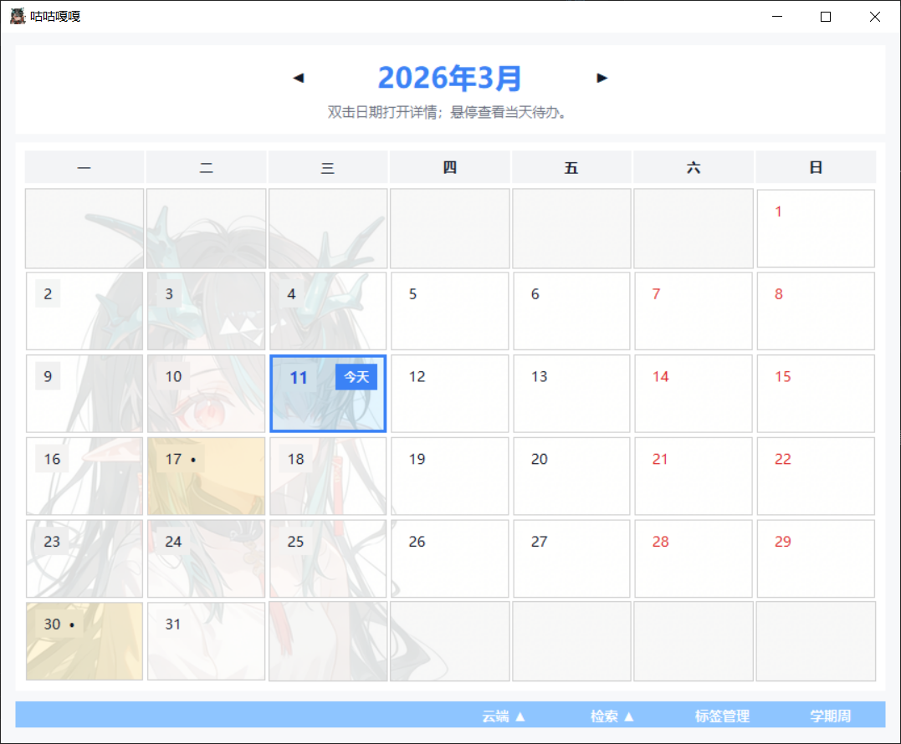
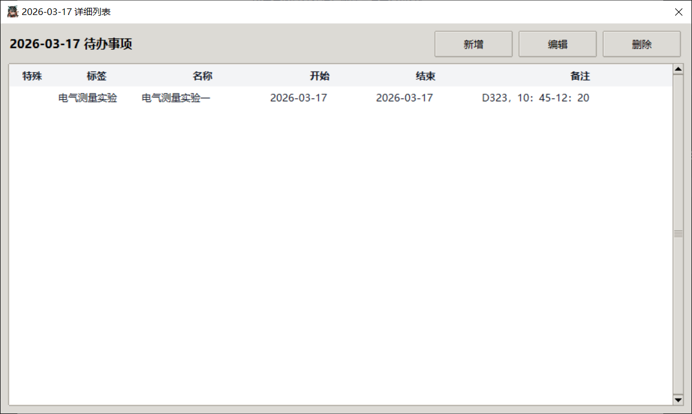
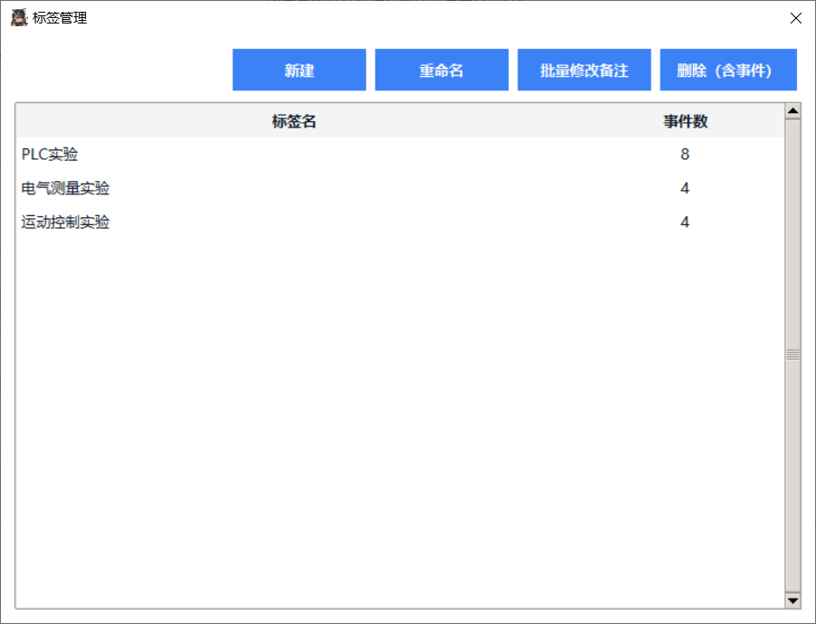
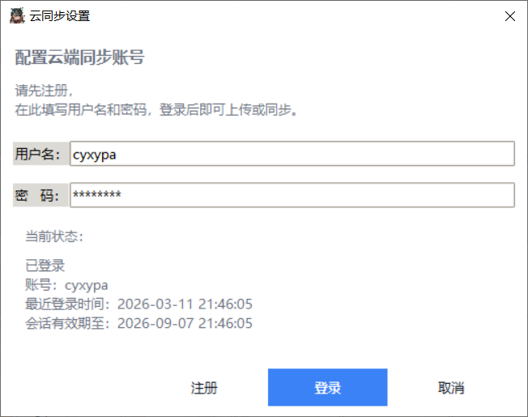

# 咕咕嘎嘎日程管理系统

基于 `tkinter` 开发的桌面日程管理软件，支持月历视图、事件增删改查、标签管理、事件检索、学期周显示、节假日提示与云端同步，提供本地持久化存储，并同时发布 `onedir` 和 `onefile` 两种可执行程序。

---

## 反馈与建议

欢迎使用本软件！如果在使用过程中遇到问题、发现 Bug，或对功能有任何改进建议，欢迎在 **Issues** 中提交反馈。

---

## 下载与发布

本仓库仅用于软件介绍与程序发布，请前往 **Releases** 页面下载可执行程序。

发布内容通常包括：

- `todo.exe`：单文件版（onefile）
- `todo.zip`：目录版压缩包（onedir）

---

## 两种程序包的区别

### onefile：单文件版
特点：
- 下载后只有一个 `.exe` 文件
- 程序数据保存在当前用户的系统应用数据目录中

默认数据库路径：
```\%AppData%\Roaming\TodoDatabase\schedule.db```
### onedir：文件夹版
特点：
- 程序以一个完整目录形式运行
- 解压后，数据库默认保存在程序所在目录中

默认数据库路径：
```\schedule.db```

---

## 软件简介

咕咕嘎嘎是一款以“月历总览”为核心的桌面日程管理工具。  
程序启动后默认进入当月日历主页，用户可以在月历中查看每天的事件分布，双击日期进入详情窗口，新增、编辑或删除事件，并通过标签、检索和学期周等功能完成更高效的日程整理。

本软件采用本地 SQLite 数据库存储日程数据，适合日常待办管理、课程安排、学习计划、周期任务记录等场景。

---

## 主要功能

### 1. 月历总览
- 以月为单位展示日历视图
- 支持前后月份切换
- 当天日期高亮显示
- 显示每日事件数量和提示信息
- 鼠标悬停可查看当天待办摘要
- 双击日期可打开当天详情窗口
- 支持节假日角标显示
- 支持学期周次显示

### 2. 日期详情
- 查看某一天的全部事件
- 新增事件
- 编辑事件
- 删除事件
- 支持对系列事件进行整组编辑或整组删除

### 3. 事件编辑
- 支持单日事件
- 支持连续区间事件
- 支持多日期非连续系列事件
- 支持开始时间和结束时间设置
- 支持备注信息
- 支持“备注锁定”，避免被标签批量备注修改覆盖

### 4. 标签管理
- 新建标签
- 重命名标签
- 删除标签
- 支持按标签批量修改备注
- 事件可按标签分类管理

### 5. 事件检索
- 支持按标签和事件进行多选检索
- 检索命中的日期会在月历中高亮显示
- 支持一键清除检索结果

### 6. 学期周功能
- 可手动设置第 1 周起始日期
- 可设置学期总周数
- 可在月历左侧显示每周对应的学期周次
- 适合课程表、教学计划、学期任务管理

### 7. 节假日提示
- 支持加载并显示节假日信息
- 节假日以角标形式展示在月历中

### 8. 云端同步
- 支持账号注册与登录
- 支持将本地日程全量上传到云端
- 支持将云端日程全量覆盖同步到本地
- 同步内容包含事件、标签和学期周设置

---

## 界面说明

### 主界面
主界面为月历视图，底部提供统一操作菜单，包含：
- 云端：同步设置、上传云端、同步本地
- 检索：事件检索、清除检索
- 标签管理
- 学期周



### 日期详情窗口
双击日历中的任意日期后，可查看该日期的全部事件，并进行新增、编辑、删除等操作。



### 标签管理窗口
用于维护标签列表，并支持批量备注修改。



### 云同步窗口
用于填写账号信息、登录云端，并进行同步操作。




---

## 项目源代码公开声明
本项目目前仍处于开发与测试阶段，现阶段暂不公开源代码。

后续版本稳定后会进行开源。
